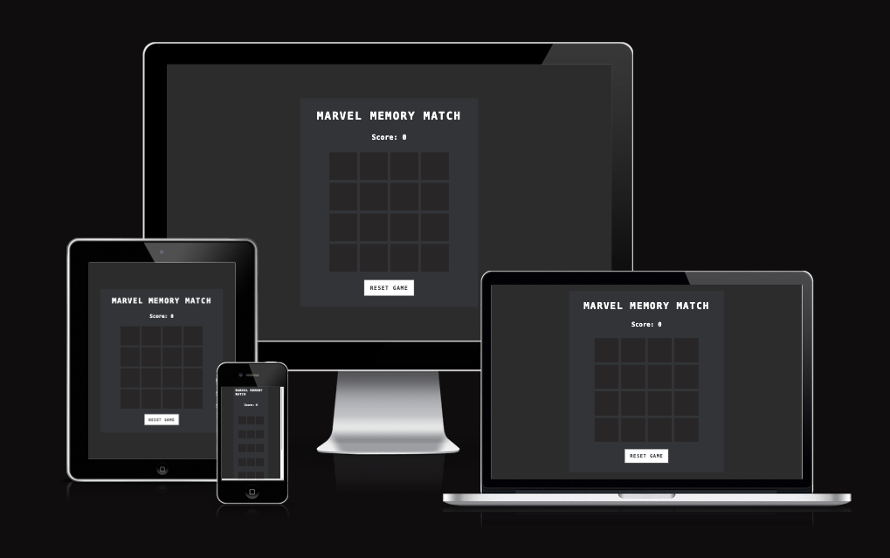
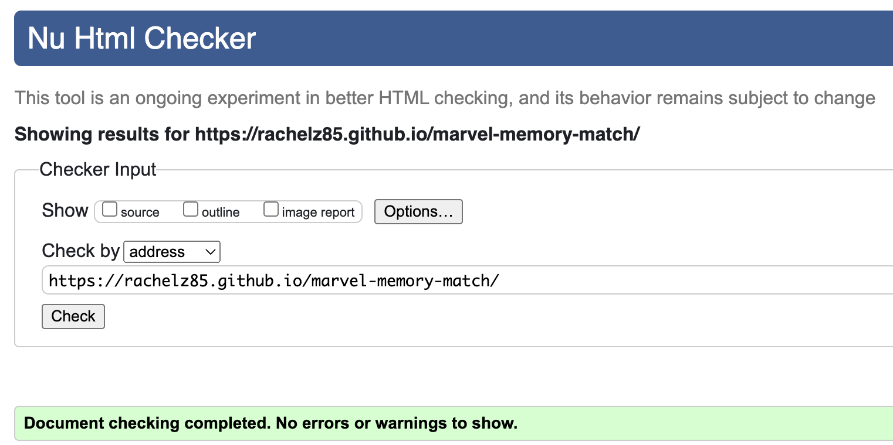
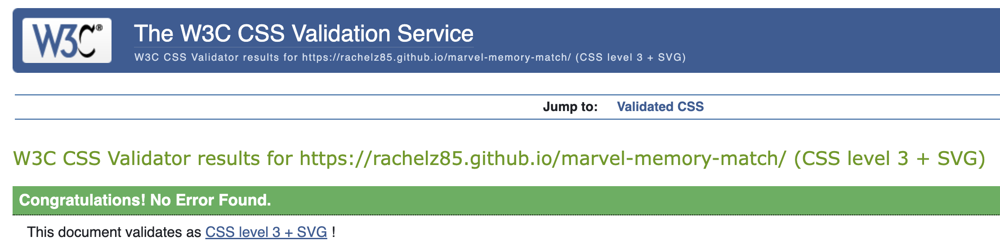

# Marvel Memory Match

Visit the live website [here.](https://rachelz85.github.io/marvel-memory-match/)

Marvel Memory Match is an engaging memory card game designed for players to match Marvel superhero images. Players flip cards to reveal heroes, aiming to locate pairs and increase their score with each successful match. Ÿ

## User Experience

### User Expectations
- Responsive design that works on desktops, tablets, and smartphones
- Intuitive gameplay without a steep learning curve
- Visual and auditory feedback for correct and incorrect matches
- A visual score tracker and game progress indicator
- Easy options to restart the game and view high scores

### User Stories
- As a player, I want the game interface to be easy to navigate, allowing me to start playing immediately without complications.
- As a player, I want to see visual effects when I make a match, so I know immediately if I have selected the correct pair.
- As a player, I want to be able to restart the game at any time if I feel like starting over.
- As a player, I want the game to be challenging but fair, with a random layout for each new game session.

## Technologies I Used

- **HTML5** - For structuring the game content.
- **CSS** - For styling all game elements and ensuring the game is visually appealing.
- **JavaScript** - For game logic, including handling card flips and matches.
- **Gitpod** -  To write, edit, commit and push my code to Github I used gitpod as the main IDE.
- **GitHub** - To host the repository and deploy the game using GitHub Pages.
- **Google Fonts** - To enhance typography.
- **Favicon.io** - To create favicon for my website.
- **Photoshop** - For editing and optimizing game images.
- **Am I Responsive?** - To test the responsiveness of the website.
- **W3C Markup Validation Service** - To validate HTML code.
- **W3C CSS Validation Service** - To validate CSS code.

## Features

- Responsive Design: Ensures that the game is accessible on any device, from phones to desktops.
- Dynamic Score Tracking: Real-time updates to the score as players match cards.
- Interactive Cards: Cards flip to reveal Marvel characters, with smooth animations for a polished user experience.
- Reset Button: Allows players to start a new game at any time.

## Testing

### Browser and Screen Size Device Testing

The game was tested on:

- **Devices**: Iphone 15, Iphone SE, Ipad Pro, Samsung Galaxi S9+, Macbook Air 13, 24" widescreen monitor, 
- **Browser**: Tested on Chrome, Firefox, and Safari ensure consistent behavior and performance.
- **Functionality**: Testing: Each interactive element (card flip, reset button) was tested to confirm it works as expected.

### Functionality Testing

| **Feature** | **Expected Outcome** | **Testing Performed** | **Result** | **Pass/Fail** |
|---------|------------------|-------------------|--------|-----------|
| **Game Initialization** | Game loads with all components properly initialized | Loaded the game in various browsers | Game loaded successfully | Pass |
| **Card Flipping** | Cards should flip to reveal the character | Clicked on cards | Cards flipped to show character | Pass |
| **Match Detection** | Correctly matched cards should remain flipped | Matched pairs of cards | Matched cards stayed flipped | Pass |
| **Mismatch Handling** | Mismatched cards should flip back after a short delay | Selected two mismatched cards | Cards flipped back after delay | Pass |
| **Score Update** | Score should update correctly when cards are matched | Matched several pairs of cards | Score updated correctly each time | Pass |
| **Game Completion** | Alert should display with the final score when all matches are found | Matched all cards to complete the game | Alert displayed with correct final score | Pass |
| **Reset Functionality** | Game should reset when the reset button is clicked | Clicked the reset button | Game reset successfully | Pass |
| **Responsive Design** | Game should be playable and visually adjusted on mobile, tablet, and desktop | Tested on various devices and screen sizes | Responsive and functional on all devices that were tested | Pass |

### Validator Testing
- **HTML**: WC3 Validator was used to validate the HTML 5 code written on all pages of my website - no errors found. 
 

- **CSS**: Passed validation without errors when tested with the official Jigsaw.

- **JavaScript**: JS Hint was used to detect errors and potential problems in the JavaScript code

## Deployment
The game is deployed on GitHub Pages. You can access it using the link at the top of this README.

### Local Deployment

The game was deployed using GitHub Pages by following these steps:

1. **GitHub Repository Settings:** Navigate to the GitHub repository containing the project.

2. **Select Deployment Branch:** In the repository, navigate to the Settings tab.

3. **Choose Branch:** For the source select Branch: main

4. **Automatic Refresh:** Once the branch is selected, the page will automatically refresh

5. **Deployment Confirmation:** After the refresh, a detailed ribbon display will appear, indicating the successful deployment of the project.

6. **Live Link:** The live link to the deployed game will be generated automatically: "Your site is published at https://rachelz85.github.io/marvel-memory-match/"

### How to Clone

1. Log into your account on GitHub.
2. Navigate to the repository of the Galactic Readers project at https://rachelz85.github.io/marvel-memory-match/
3. Click on the Code button, and copy your preferred clone link (HTTPS or SSH).
4. Open the terminal in your code editor and change the current working directory to the location where you want the cloned directory to be placed.
5. Type git clone, then paste the link you copied, and press Enter.
 
 ### How to Fork 

1. Log in (or sign up) to GitHub.
2. Navigate to Galactic Readers project repository at https://rachelz85.github.io/marvel-memory-match/
3. Click the Fork button in the top right corner of the page.

## Credits and Resources

- **Code** The code writing and game functions based and adapted from [FreecodeCamp](https://www.youtube.com/@freecodecamp/videos)

- **Favicon** Created using favicon.io based on game graphics. [Favicon](https://favicon.io/)

- **Fonts** from [Google Fonts](https://fonts.google.com/)

- All Marvel character images were created by my partner Ariel, specifically for this project with Comfyui using a stable diffusion model.

 